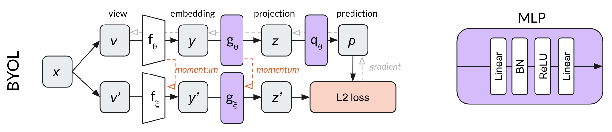

# BYOL

Bootstrap Your Own Latent (BYOL) is a [[self-supervised_learning]] algorithm that doesn't require negative examples, such as [[simCLR]] and [[MoCo]].

While MoCo and simCLR use [[contrastive_learning]] between positive and negative examples in their loss functions, BYOL uses only positive examples in the loss function. At first glance, BYOL appears to be doing self-supervised learning without contrasting between different images at all. However, it appears that the primary reason BYOL works is that it is doing a form of contrastive learning — just via an indirect mechanism.

BYOL builds on the momentum network concept of MoCo, adding an [[multilayer_perceptron]] $q_\theta$ to predict z’ from z. Rather than using a contrastive loss, BYOL uses the L2 error between the normalized prediction p and target z’. As an example, BYOL tries to convert both crops of a dog image into the same representation vector (make p and z’ equal.) Because this loss function does not require negative examples, there is no use for a memory bank in BYOL.

Both MLPs in BYOL use [[batch_normalization]] after the first linear layer only.

### Resources

- https://arxiv.org/abs/2006.07733
- https://untitled-ai.github.io/understanding-self-supervised-contrastive-learning.html